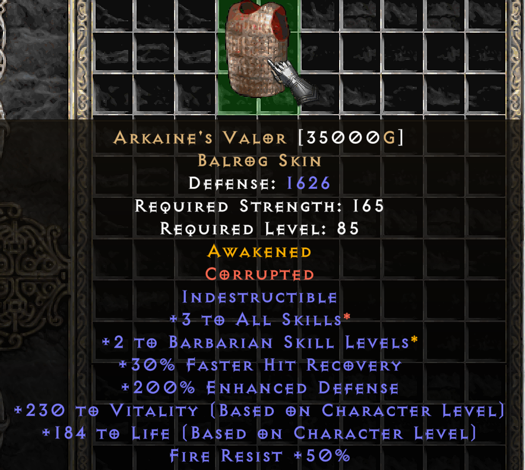

# PD2 SP Reawakening

Forked from [PD2SPPlus](https://github.com/Lukaszpg/PD2-Single-Player-Plus-mod)

### [Full Patch Notes](https://docs.google.com/document/d/e/2PACX-1vTqp7Uys-XhuvmhnynkNjRt2Z8e0DdEXGOJ66JhgRUDMajI9jWIxw5va9pukdOU_xotWZzO-_zdPdah/pub)

## New Features
- **Awakening**: A new system similar to corruption. Equipment and unique charms can be awakened when cubed with a Vial of Awakening, awakening it with a new property.
- **Fate Cards:** Stackable uncommon drops, that upon collecting a certain amount, can be cubed together in exchange for a reward. Similar to Path of Exile’s [divination cards](https://pathofexile.fandom.com/wiki/Divination_card).
- **Legacy Items**: Obtained through a rare drop Relic of the Nephalem, these legacy items are extremely powerful items from back in the good old days of patch 1.08.
- **New Orbs**:
    - *Mythic Orb*: Converts non-ethereal item to unique
    - *Divine Orb*: Rerolls unique item
    - *Coin*: Gold sink purchasable from Akara, hover over item to see recipes
- **Rune Downgrading**: Runes are downgradable in a 1:1 ratio with cube recipe: key + unstacked rune. Runes above Ist require a Coin in the cube recipe.
- **Item Changes**: Introducing new uniques, new runewords, and updating old ones to bring them back into play

### Relive some of the nostalgic moments of 1.08 with the modern features of Project Diablo 2.

## Installation
If you've played PlugY or any other PD2 single player mod, your current characters/stash will likely be incompatible.
1. Create a copy of your PD2 installation in a new directory.
1. Install [PD2-PlugY](https://github.com/BetweenWalls/PD2-PlugY)
1. Go to [Releases](https://github.com/synpoox/pd2-reawakening/releases) and download the latest `pd2data.mpq` and `BH.dll`
1. Copy and paste `pd2data.mpq` and `BH.dll` into your new PD2-PlugY install, overwriting any old files.
1. Launch the game with `Plugy.exe`
1. Go to Akara and look for an item with Alkor's quest potion. If it's there, then the mod was installed successfully.
