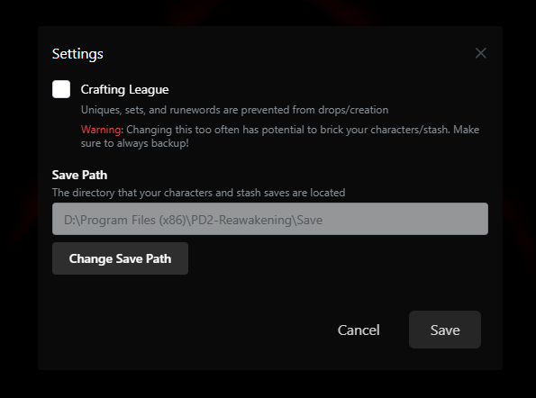

# PD2 SP Reawakening

Originally I just wanted to add some items to the game from 1.08, but after lurking in r/projectdiablo2 and the pd2’s #feedback channel I decided to implement a bunch of things that I either agreed with or just straight up thought would be fun.

Comments and feedback would be very appreciated, join the [Discord](https://discord.gg/rBCNMWaCNt) and share your thoughts!

Forked from the original sp mod [PD2 SP Plus](https://github.com/Lukaszpg/PD2-Single-Player-Plus-mod)

**[Discord](https://discord.gg/rBCNMWaCNt) | [Guidebook](https://docs.google.com/document/d/e/2PACX-1vTqp7Uys-XhuvmhnynkNjRt2Z8e0DdEXGOJ66JhgRUDMajI9jWIxw5va9pukdOU_xotWZzO-_zdPdah/pub) | [Latest Patch Notes (v0.9.6)](https://docs.google.com/document/d/1WFCpWh4WYfvxvOdTp1WW_NXk6l_grt4e5FdxcZ2zqCI/pub)**

## New Features

- **Awakening**: A new system similar to corruption. Equipment and unique charms can be awakened when cubed with a Vial of Awakening, awakening it with a new property.
- **Fate Cards:** Stackable uncommon drops, that upon collecting a certain amount, can be cubed together in exchange for a reward. Similar to Path of Exile’s [divination cards](https://pathofexile.fandom.com/wiki/Divination_card).
- **Legacy Items**: Obtained through a rare drop Relic of the Nephalem, these legacy items are extremely powerful items from Diablo 2 LoD patch 1.08.
- **New Orbs**:
  - _Mythic Orb_: Transforms Magic/Rare item to Unique (excluding charms)
  - _Regal Orb_: Transforms Magic/Rare item to Set
  - _Divine Orb_: Rerolls unique item, limited to: equipment, jewelry, grand charms
  - _Orb of Unmaking_: Allows an item to be Awakened once more, keeping existing properties intact.
  - _Coin_: Gold sink purchasable from Akara
- **Item Changes**: Introducing new uniques, new runewords, and updating old ones to bring them back into play
- **New Cube Recipes**: +2 class skill Circlet crafting, rune downgrading, and more.
- **Drop Rate Increases**:
  - Rune drops increased by 500%
  - Drop rates increased across the board, see TreasureClassEx.txt for specifics or see [this](https://docs.google.com/spreadsheets/d/e/2PACX-1vSmG2BYE-c6W7l0ha8OcyEQROgDSKFtR99mWHuT9XM6OXW_f4ym87x-d5GrhlO37msQqxt2IJj_XRbF/pubhtml) for a short comparison
- **Crafting League Option**:
  - Uniques, sets, and runewords are disabled (All unique charms are exceptions)
  - Mythic orbs, Divine orbs, Regal orbs, and certain Fate Cards no longer drop
  - Uber materials such as: Voidstone, Vision of Terror, Pandemonium Talisman are purchasable from Anya
  - Easily switch between Standard and Crafting modes through the PD2 Reawakening Launcher

### Remember 08 Arkaine's? This is him now


## Installation

If you've played PlugY or any other PD2 single player mod, your current characters/stash will likely be incompatible.

#### With Launcher (auto-updates Reawakening patches)

1. Create a copy of your PD2 installation in a new directory.
1. Install [PD2-PlugY](https://github.com/BetweenWalls/PD2-PlugY)
1. Download the [Latest Release](https://github.com/synpoox/pd2-reawakening-launcher/releases/latest) of [PD2 Reawakening Launcher](https://github.com/synpoox/pd2-reawakening-launcher)
1. Install it in the same folder that `PlugY.exe` is located in.
1. Run `PD2 Reawakening Launcher.exe` as Administrator (if needed).
1. Go to Akara and look for an item with Alkor's quest potion. If it's there, then the mod was installed successfully.

#### Manual Install (No auto-updates)

1. Create a copy of your PD2 installation in a new directory.
1. Install [PD2-PlugY](https://github.com/BetweenWalls/PD2-PlugY)
1. Go to [Releases](https://github.com/synpoox/pd2-reawakening/releases) and download the latest `pd2data.mpq` and `BH.dll`
1. Copy and paste `pd2data.mpq` and `BH.dll` into your new PD2-PlugY install, overwriting any old files.
1. Launch the game with `Plugy.exe`
1. Go to Akara and look for an item with Alkor's quest potion. If it's there, then the mod was installed successfully.

## Changing Save Folder Path

Following the above instructions will point your new PD2 Reawakening install your old PD2 save folders, which can cause errors with incomptable characters/stashes. To change your save folder path:

#### With Launcher
1. Click `Settings` in the top left
1. Click `Change Save Path`
1. Select your desired Save directory



#### Without Launcher

1. Open `ProjectDiablo.json` in your new `...\PD2-Reawakening\ProjectD2` folder
1. Look for `"save_path"` and edit it to your chosen directory:

```JSON
"other": {
  "lng_file": "",
  "installpath": "C:\\Program Files (x86)\\PD2-Reawakening\\",
  "save_path": "C:\\Program Files (x86)\\PD2-Reawakening\\Save\\"
}
```
**Note that double backslashes are required**

## Toggling Between Standard and Crafting

1. Click the `Settings` button in the top left
1. Toggle the checkbox to enable/disable Crafting League
1. Press `Save`

### **WARNING: Enabling Crafting league and logging into a character can sometimes cause runewords to be deleted from that character and your stash**

_Always make backups of your saves_

## Pastable Loot Filter Code

This contains all the new item types (fate cards, new orbs, relic of the nephalem), stylized for Kryszard's filter.
1. Open `loot.filter` in your `...\PD2-Reawakening\ProjectD2` directory
1. Paste the following somewhere near the top

```
//PD2 Single Player Reawakened
ItemDisplay[awst OR mfo OR exo OR dvo OR rgo OR dvia]: %BORDER-0A%%DOT-62%%GREEN%*%PURPLE%*%RED%*       %NAME%       %RED%*%PURPLE%*%GREEN%*
//rare fate card
ItemDisplay[fsha OR fsjp OR fsdi OR fsfr]: %BORDER-0A%%DOT-62%%GREEN%*%PURPLE%*%RED%*       %NAME%       %RED%*%PURPLE%*%GREEN%*
//uncommon fate cards
ItemDisplay[fsdg OR fsds OR fsdb OR fstc OR fspv OR  fslc OR fstl OR fsdw OR fsps OR fsbr]: %BORDER-0A%%DOT-62%%GREEN%*%PURPLE%*       %NAME%       %PURPLE%*%GREEN%*
//common fate cards
ItemDisplay[fslr OR fslu OR fsat OR fsus OR fsrb OR fstm OR fsdn OR fsht OR fsvi OR fscf OR fsgd OR fsed OR fscs OR fsta OR fsts OR fstf OR fshs OR fsar OR fstw OR fsms OR fsla]: %BORDER-0A%%DOT-62%*%PURPLE%      %NAME%      
ItemDisplay[fsbl OR fssf OR fsse OR fsew OR fssg OR fsuf OR fsmw OR fsap OR fsem OR fstu OR fstb]: %BORDER-0A%%DOT-62%*%PURPLE%      %NAME%      
//relic
ItemDisplay[rotf OR oou]: %BORDER-68%%ORANGE%pick %PURPLE%*%RED%*%YELLOW%*%GREEN%*     %NAME%     %GREEN%*%YELLOW%*%RED%*%PURPLE%* %ORANGE%up
```
